# Einrichtung einer Entwicklungsumgebung für das Minecraft Modding

Für das Minecraft Modding ist es notwendig einige Programme zu installieren. Welche Programme das sind, wofür diese benötigt werden, wo ihr diese herunterladen könnt und wie sie installiert werden wird im Folgenden kurz beschrieben. Die Installation von Minecraft selbst wird hier nicht mehr gesondert behandelt. Die Installationsbeschreibung bezieht sich auf Windows, da auch die Kursrechner mit Windows ausgestattet sind. Solltet ihr Hilfe bei der Einrichtung der genannten Software auf einem anderen System benötigen, dann könnt ihr uns jederzeit ansprechen.

## Java

Java ist sowohl eine Programmiersprache als auch eine sogenannte *Laufzeitumgebung*. Darunter versteht man eine Reihe von Programmen und anderen Komponenten, die benötigt werden, um mit Java erstellte Software auf einem Computer zu betreiben. Wichtig zu beachten ist, dass es verschiedene Versionen von Java gibt. Wir verwenden in unserem Fall die Version 1.8 (auch als Java 8 bezeichnet). Das ist die derzeit aktuelle Version. Diese könnt ihr kostenlos von der Oracle Webseite herunterladen. Dabei müsst ihr darauf achten, dass ihr das sogenannte *JDK*, das Java Development Kit herunterladet und nicht das *JRE*. Der Unterschied besteht darin, dass das JDK zur Erstellung von Programmen gedacht ist, also für das Programmieren. Das JRE hingegen ist nur dazu da, bestehende Programme auszuführen (damit könnt ihr also keine Mods programmieren).
  
Ladet den Installer von folgender Seite herunter:
<http://www.oracle.com/technetwork/java/javase/downloads/index.html>
  
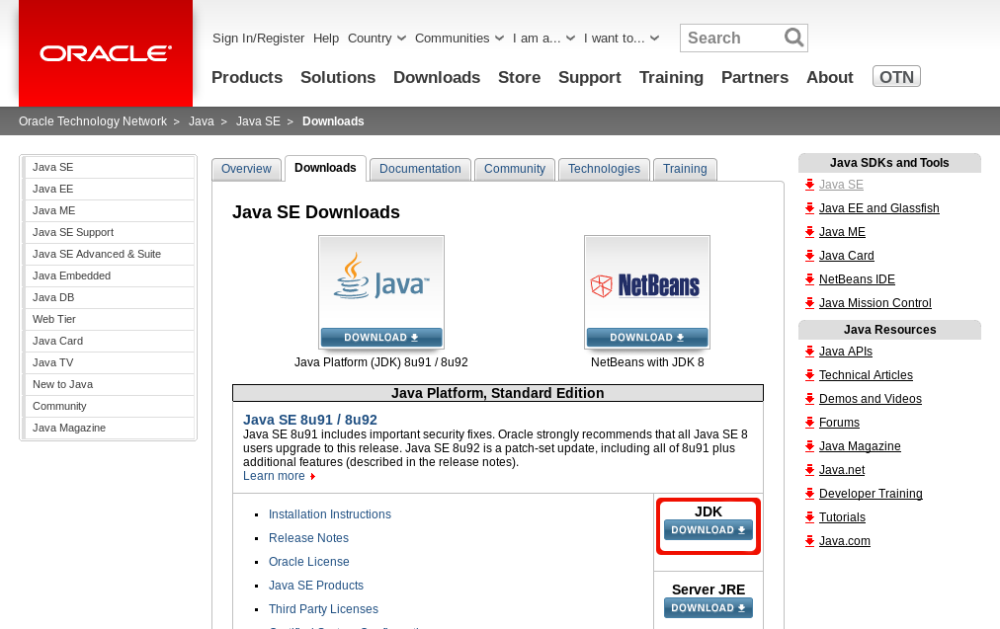
  
Bevor ihr hier eine Datei herunterladen könnt, müsst ihr “Accept License Agreement” auswählen. Dann könnt ihr die für euer System entsprechende Installationsdatei herunterladen (normalerweise wird das die 64 bit Version, wie im Bild unten gezeigt, sein).
  
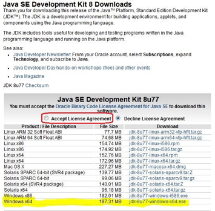
  
Bei der Installation könnt ihr einfach die Standardoptionen übernehmen und immer “Next” oder “Weiter” bestätigen.
  
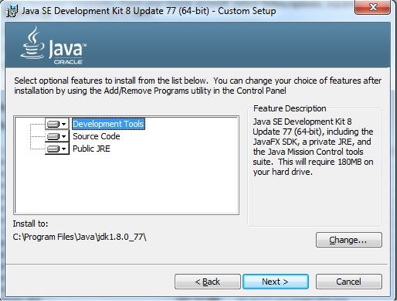
  
Wichtig zu beachten ist außerdem, dass ein paar Einstellungen im System vorzunehmen sind, um sicherzustellen, dass Java richtig funktioniert und von anderen Programmen gefunden wird. Dazu ist eine Systemvariable (Umgebungsvariablen) zu setzen: `JAVA_HOME`
  
Die Umgebungsvariablen könnt ihr unter Windows in der Systemsteuerung anpassen. Dazu wählt ihr `Start > Systemsteuerung > System und Sicherheit > System` aus (mit “Start” ist in diesem Fall die Schaltfläche mit dem Windowssymbol unten links auf dem Desktop gemeint). Hier gibt es nun im Menü auf der linken oberen Seite eine Option namens *Erweiterte Systemeinstellungen*. Über diese gelangt ihr in einen Dialog, der euch das Setzen der oben genannten Variablen ermöglicht. Die folgenden Bilder fassen die Schritte noch einmal kurz zusammen:
  
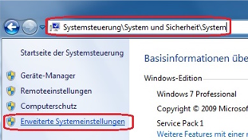
 Systemsteuerungsdialog
  
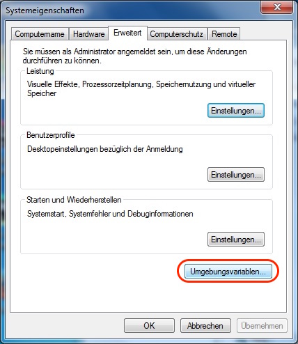
 Erweiterte Systemeigenschaften
  
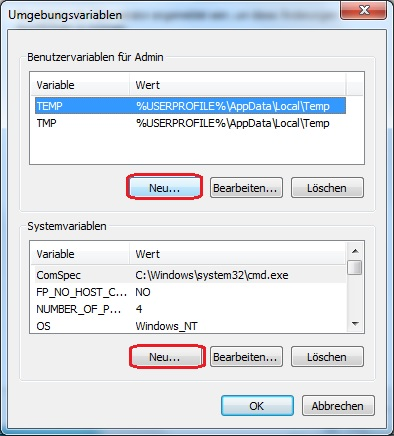
 Hier können jetzt die Variablen gesetzt werden
  
Wichtig zu beachten ist hier, dass es zwei Möglichkeiten gibt Umgebungsvariablen zu setzen. Wenn ihr auf die obere Schaltfläche, die mit neu beschriftet ist, klickt, dann legt ihr eine neue Umgebungsvariable für den aktuellen Benutzer an. Die untere Schaltfläche mit der Aufschrift *Neu...* ermöglicht es euch, allgemeine Variablen, die für alle Benutzer des Systems gelten, anzulegen. Wir werden im Folgenden die untere Schaltfläche verwenden, was voraussetzt, dass ihr Administratorrechte habt. Alternativ könnt ihr auch eine Variable nur für euren Benutzer setzten.
  
Nun kommen wir zum Setzen der Variablen `JAVA_HOME`. Diese sagt dem System und anderen Programmen, wo Java installiert ist. Normalerweise ist das `C:\Programme\Java\jdk1.8...`. Klickt also jetzt auf die untere Schaltfläche mit der Aufschrift *Neu...* und tragt den Java Installationspfad, wie im Bild unten gezeigt, ein.
  
**WICHTIG:** Achtet darauf, dass das Verzeichnis mit eurem Installationsverzeichnis von Java übereinstimmt.
  
**TIPP:** Um Arbeit zu sparen, könnt ihr einfach mit der Maus in den Java-Ordner wechseln und dann den Dateipfad aus der Adresszeile (oben unter dem Menü) kopieren. Dann müsst ihr nicht alles tippen und seid sicher, dass der Pfad auch stimmt.
  
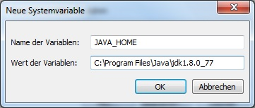
 Java Installationsverzeichnis angeben
  
Bestätigt nun den Dialog mit *Ok*. Damit ist die Variable gesetzt und ihr könnt die Systemsteuerung schließen.
  
Um zu überprüfen ob die Variable richtig gesetzt wurde, könnt ihr ein Konsolenfenster öffnen und hier  dem Befehl `echo %JAVA_HOME%` eingeben. Jetzt sollte der von euch angegebene Pfad in der Konsole angezeigt werden. Die Konsole erreicht ihr übrigens am Einfachsten, wenn ihr erst auf die Startschaltfläche mit dem Windowssymbol klickt und dann im Suchfeld unten links `cmd` eingebt. Das Programm, das euch dann angezeigt wird, ist die Konsole. Diese könnt ihr, wie alle anderen Programme unter Windows auch, per Klick öffnen.

## IntelliJ

Für die Entwicklung mit Java ist es empfehlenswert eine Entwicklungsumgebung (auch IDE genannt) zu verwenden. Diese bietet nicht nur einen komfortablen Editor, sondern auch jede Menge Hilfsfunktionen, die euch beim Programmieren das Leben leichter machen. Für Java gibt es verschiedene Optionen, wobei wir im Folgenden IntelliJ verwenden werden, da diese IDE sehr benutzerfreundlich, leistungsstark und in der Community Edition kostenlos ist.
  
Ladet also nun IntelliJ von der JetBrains-Webseite herunter. Der Link lautet wie folgt:
  
<http://www.jetbrains.com/idea/?fromMenu#chooseYourEdition>
  
Wichtig ist, dass ihr die *Community Edition* herunterladet. Der folgende Screenshot zeigt wo ihr klicken müsst:
  
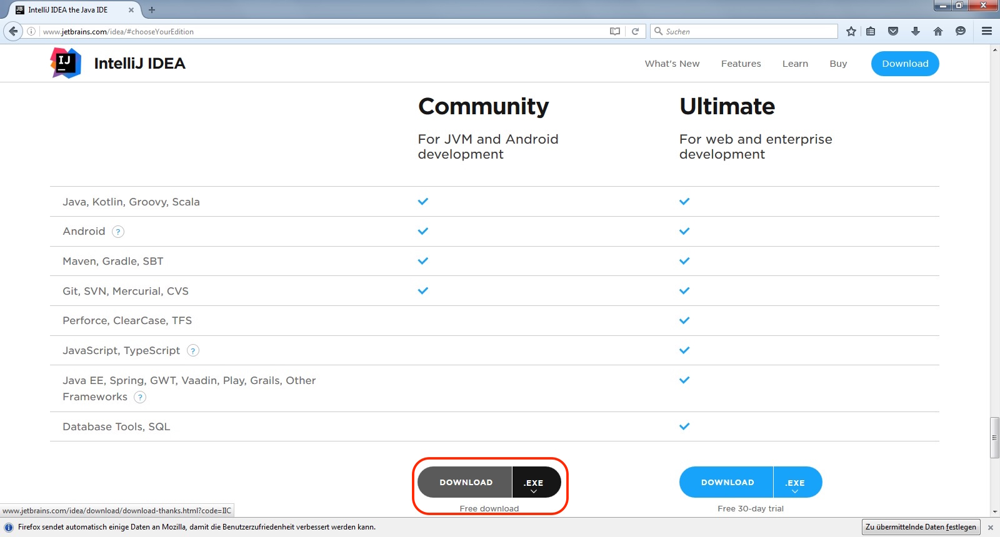
  
Sobald ihr IntelliJ heruntergeladen habt, könnt ihr die Datei per Doppelklick installieren. Die meisten Optionen könnt ihr auf den Standardeinstellungen belassen. Solltet ihr eine Desktopverknüpfung anlegen wollen, dann ist das während der Installation möglich. Achtet dabei darauf, dass ihr eine Verknüpfung zur 64bit Version von IntelliJ anlegt, da ihr dann mehr Speicher nutzen könnt. Das ist wichtig, denn Java Programme benötigen oft relativ viel Arbeitsstpeicher. Um die erwähnte 64bit Verknüpfung zu erstellen müsst ihr nichts weiter tun als einen Haken an die richtige Option zu setzen. Der folgende Screenshot zeigt, wo ihr diese Option genau findet:
  
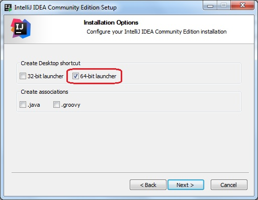
  
Die restlichen Optionen können alle auf den Standardeinstellungen belassen werden. Sobald das Setup abgeschlossen ist, habt ihr eure Entwicklungsumgebung installiert.
  
**HINWEIS:** Beim ersten Start von IntelliJ werden einige Einstellungen abgefragt. Diese könnt ihr einfach so eingestellt lassen wie sie sind und immer weiter klicken. Die Standardeinstellungen von IntelliJ sind in aller Regel gut und sinnvoll gewählt.

## Forge

Zu guter Letzt benötigt ihr noch Forge. Das ist das eigentliche Framework, also der “Rahmen” für eure Mods. Forge könnt ihr ebenfalls kostenlos aus dem Netz herunterladen. Eine Warnung aber vorweg: Es findet sich sehr viel Werbung auf der Forge Download-Seite. Ignoriert einfach die Werbebanner und verwendet am Besten den direkten Download-Link, wie wir ihn im Folgenden beschreiben. Sollte der Link nicht mehr funktionieren, findet ihr weiter unten eine kurze Beschreibung wie ihr euch den direkten Link “zusammenkopieren” könnt. Das ist wichtig, damit ihr euch nicht versehentlich irgendwelche unerwünschten Werbeprogramme installiert.
  
Wir verwenden Forge 1.8.9 für unsere Projekte. Der direkte Downloadlink hierzu lautet:
 
<http://files.minecraftforge.net/maven/net/minecraftforge/forge/1.8.9-11.15.1.1855/forge-1.8.9-11.15.1.1855-mdk.zip>
  
Forge muss nicht installiert, sondern nur entpackt werden. Legt euch am Besten ein Verzeichnis für das Modding an und entpackt die Zip-Datei hier. Dann habt ihr es fast geschafft. Um Mods bauen zu können müsst ihr allerdings erst noch Forge einmal bauen. Das geht ganz einfach über die Konsole, die wir ja auch schon bei der Java-Installation benutzt haben. Um die Arbeit etwas zu erleichtern, könnt ihr direkt im Verzeichnis, in das ihr Forge entpackt habt ein Konsolenfenster öffnen. Dazu müsst ihr nur Shift gedrückt halten und einmal rechts klicken. Im folgenden Menü wählt ihr nun die Option “Eingabeaufforderung hier öffnen” aus und das schon bekannte schwarze Konsolenfenster öffnet sich. Hier gebt ihr nun “gradlew setupDecompWorkspace” (wieder ohne Anführungszeichen) ein und bestätigt mit enter. Nun wird euer Rechner eine Weile beschäftigt sein. Wenn alles fertig ist, dann solltet ihr folgendes Bild sehen:
  
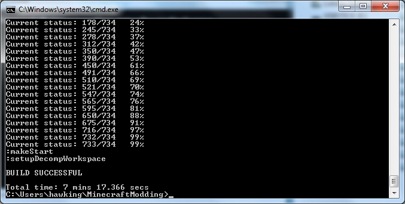
  
Nun müsst ihr nur noch das Forge-Projekt in IntelliJ öffnen. Die folgenden Screenshots zeigen wie das geht:
  
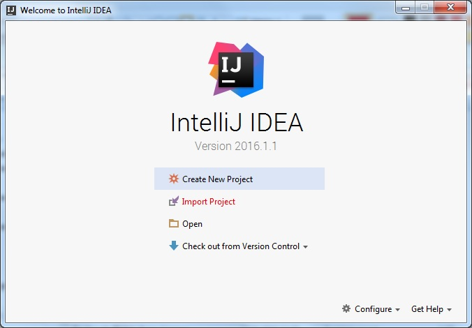
 Wählt hier *Import Project aus*
  
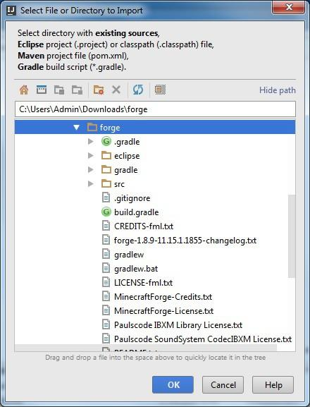
 Öffnet den Ordner, in dem ihr Forge entpackt habt
  
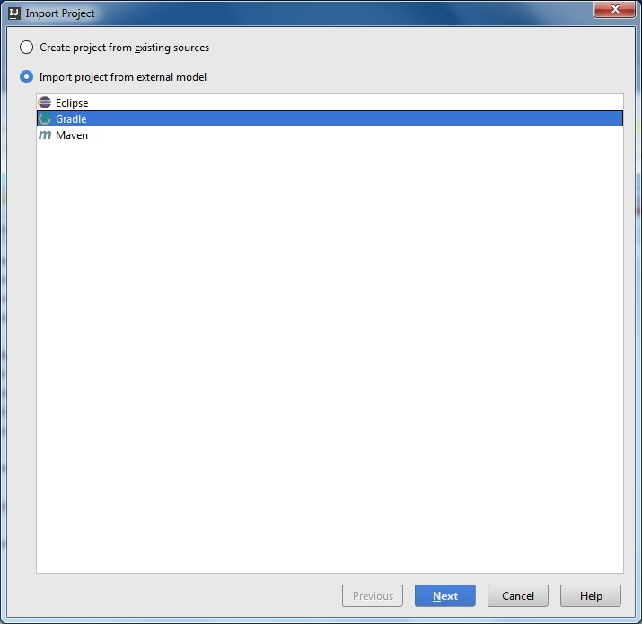
 Wählt hier *Import project from external Model* und markiert *Gradle*
  
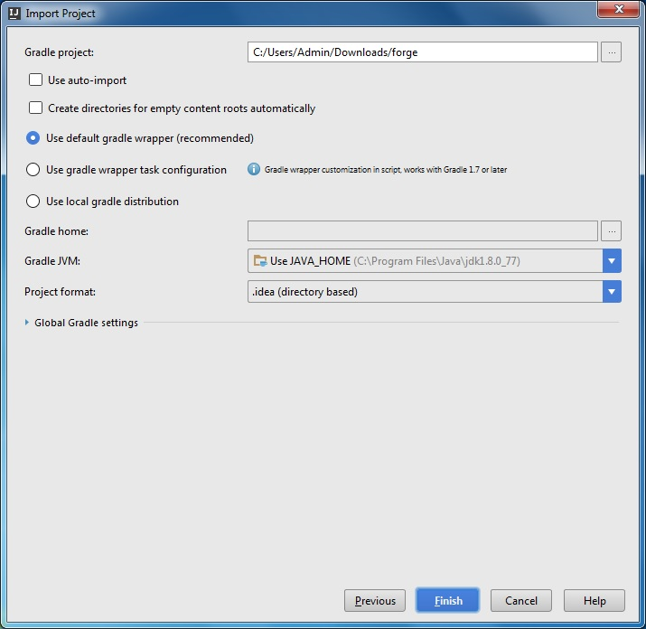
 Übernehmt hier die Standardoptionen, wie im Bild gezeigt
  
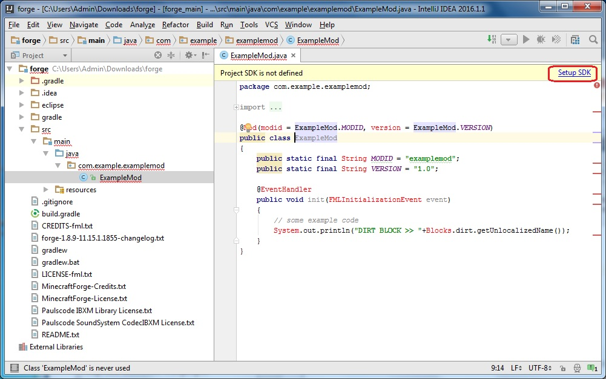
 Eventuell müsst ihr nun noch Java konfigurieren. Klickt dazu auf *Setup JDK*
  
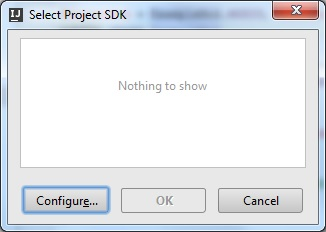
 Hier klickt ihr nun auf *Configure...*
  
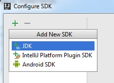
 Klickt auf das Plus und dann *JDK*
  
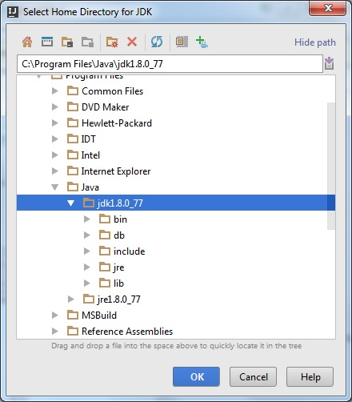
 Wählt euer Java-Verzeichnis aus
  
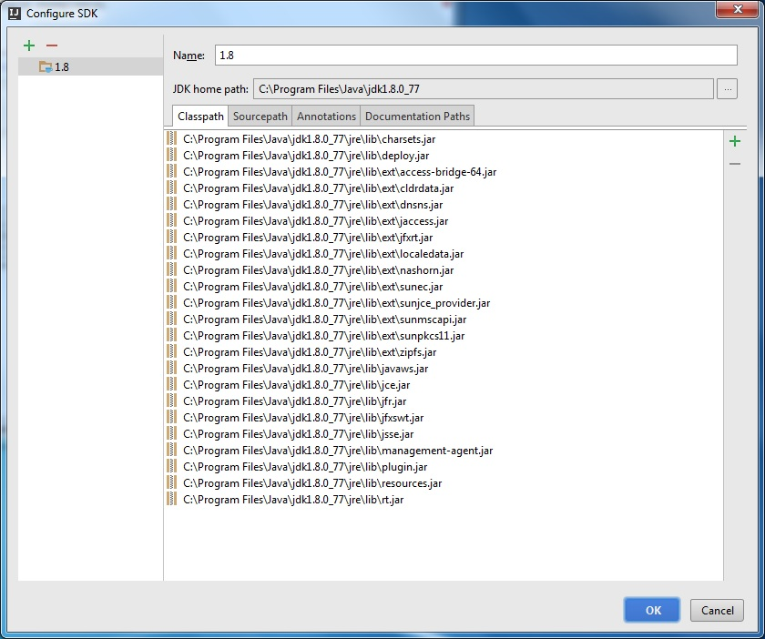
 Wenn alles funktioiniert hat, solltet ihr nun folgendes sehen

Das wars! Jetzt ist alles für das Modden vorbereitet. Wie das genau geht erfahrt ihr im Kurs. Viel Spaß!
